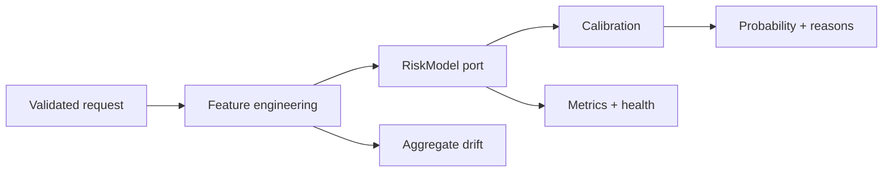

# RiskLens

[](https://github.com/ryewmn/risklens-java/actions/workflows/ci.yml)

RiskLens is a production-shaped Java 17 service for explainable credit-default risk inference. It turns a versioned model artifact into a validated REST API with calibrated probabilities, stable reason codes, drift signals, Prometheus metrics, health probes, and privacy-safe operational logs.

It is a portfolio and learning project, not a lending decision system. The bundled model is trained on synthetic data and must not be used to approve, deny, or price credit.

## Why this project exists

Most ML demos stop after model training. RiskLens focuses on the engineering work that starts afterward: artifact integrity, input contracts, reproducible parity, observability, graceful failure, privacy, and a clean boundary for replacing the reference model with ONNX Runtime.



## Highlights

- Typed Spring Boot API with Jakarta Bean Validation and RFC 9457 problem details
- Deterministic JSON logistic artifact as the zero-native-dependency default engine
- `RiskModel` and `OnnxScoringPort` boundaries for an ONNX Runtime deployment adapter
- SHA-256 model identity returned with every prediction
- Calibrated probability, four risk bands, and ranked reason codes
- Safe drift monitoring that keeps running sums, never raw applicant records
- Prometheus inference count and latency metrics
- Kubernetes-compatible liveness/readiness probes and graceful shutdown
- Java/Python parity fixtures checked to 12 decimal places
- Dependency-free Python training pipeline using synthetic data by default
- Docker, CI, architecture, threat model, model card, security policy, and OpenAPI contract

## Quick start

Requirements: Java 17+ and either `unzip` plus `curl`/`wget`, or Maven 3.9+.

```bash
chmod +x mvnw
./mvnw test
./mvnw spring-boot:run
```

In another terminal:

```bash
curl -i http://localhost:8080/api/v1/predictions \
  -H 'Content-Type: application/json' \
  --data '{
    "creditLimit": 200000,
    "age": 41,
    "repaymentStatusCurrent": 0,
    "repaymentStatusPrior": 0,
    "billAmountCurrent": 54000,
    "billAmountPrior": 51000,
    "paymentAmountCurrent": 9000,
    "paymentAmountPrior": 8500
  }'
```

Example response:

```json
{
  "requestId": "eb3da8d4-36a8-469e-9e16-24ab15abe5e2",
  "defaultProbability": 0.20463803236738098,
  "riskBand": "MODERATE",
  "reasonCodes": ["RISING_BALANCE_TREND"],
  "model": {
    "id": "risklens-credit-default",
    "version": "1.0.0-synthetic",
    "artifactSha256": "<64-character SHA-256>",
    "trainedAt": "2026-08-25T00:00:00Z",
    "engine": "logistic-json"
  },
  "predictedAt": "2026-08-25T12:00:00Z"
}
```

Useful endpoints:

| Endpoint | Purpose |
|---|---|
| `POST /api/v1/predictions` | Score one validated request |
| `GET /api/v1/model` | Inspect deployed artifact identity |
| `GET /api/v1/model/drift` | View safe aggregate drift status |
| `GET /actuator/health/liveness` | Process health |
| `GET /actuator/health/readiness` | Model readiness |
| `GET /actuator/prometheus` | Prometheus metrics |

The full contract and examples are in [`docs/openapi.yaml`](docs/openapi.yaml).

## Reproduce model training

The default command uses 3,000 seeded synthetic records and writes to an ignored build directory:

```bash
python3 training/train.py --synthetic-rows 3000 --seed 1729 --output build/model.json
python3 -m unittest training/test_parity.py
```

To experiment with the UCI Default of Credit Card Clients schema, obtain the CSV yourself, review its current license, and run:

```bash
python3 training/train.py --uci-csv /path/to/your/uci-default.csv --output build/model.json
```

RiskLens expects `LIMIT_BAL`, `AGE`, `PAY_0`, `PAY_2`, `BILL_AMT1`, `BILL_AMT2`, `PAY_AMT1`, `PAY_AMT2`, and the documented default target. Sex, education, and marital-status fields are intentionally excluded. No third-party dataset is bundled or downloaded.

## Reproducible sample results

These are demonstration results, not claims of real-world performance. Evaluation used the seeded synthetic generator and an 80/20 holdout. Latency measures the dependency-free Python parity scorer on this development container, not Spring HTTP latency or a service-level objective.

| Area | Metric | Sample result | Command or method |
|---|---:|---:|---|
| Discrimination | ROC AUC | 0.6836 | `train.py`, seed 1729 |
| Accuracy | threshold 0.5 | 0.7817 | 600-row synthetic holdout |
| Calibration | Brier score | 0.1687 | Lower is better |
| Calibration | ECE, 10 bins | 0.0556 | Absolute bin gap |
| Reference latency | p50 | 0.0017 ms | 10,000 in-process Python scores |
| Reference latency | p95 | 0.0019 ms | 10,000 in-process Python scores |
| Reference latency | p99 | 0.0028 ms | 10,000 in-process Python scores |

Before any real deployment, measure the built Java service under representative concurrency, validate subgroup performance, recalibrate on governed data, and define alert thresholds from a production baseline.

## Swap in ONNX Runtime

The core application depends only on `RiskModel`. `OnnxRiskModelAdapter` fixes the ordered feature-vector contract, while `OnnxScoringPort` isolates native runtime calls. A deployment module can:

1. Add ONNX Runtime as a pinned dependency.
2. Implement `OnnxScoringPort` with one long-lived `OrtEnvironment` and `OrtSession`.
3. Parse the companion artifact and register `OnnxRiskModelAdapter` as the `RiskModel` bean.
4. Start with `--spring.profiles.active=onnx`, which disables the JSON logistic component.
5. Run the parity cases before promotion.

This keeps native binaries out of the default build and makes the provider lifecycle explicit.

## Operational guardrails

- Requests and responses use `Cache-Control: no-store`.
- Logs include only generated request ID, model version, error type, and latency. They exclude feature values and probabilities.
- Drift state contains counts and sums of four normalized aggregate features. It cannot reconstruct a submitted record.
- Model artifacts fail closed at startup when calibration, feature scale, or coefficients are invalid.
- The Docker image runs as a non-root user with a bounded JVM memory percentage.
- Protect inference, model, drift, and metrics routes with authentication and network policy before external exposure.

## Documentation

- [Architecture](docs/ARCHITECTURE.md)
- [Threat model](docs/THREAT_MODEL.md)
- [Model card](docs/MODEL_CARD.md)
- [Security policy](SECURITY.md)
- [Contribution guide](CONTRIBUTING.md)

## Limitations

- The bundled model is synthetic, small, and intentionally interpretable.
- Reason codes are contribution-based explanations, not causal explanations.
- The in-memory drift monitor resets at process restart and is not a formal PSI implementation.
- Authentication, rate limiting, durable audit delivery, and an ONNX native provider belong at the deployment boundary.
- Regulatory, fairness, adverse-action, accessibility, privacy, and human-review requirements are not satisfied by this repository alone.

## Roadmap

- Add a production ONNX Runtime provider module and signed model manifest
- Add OpenTelemetry traces with attribute allowlisting
- Export aggregate drift snapshots to a time-series backend
- Add contract, load, chaos, and container vulnerability tests
- Add governed calibration and subgroup evaluation workflows

Licensed under the [MIT License](LICENSE).
