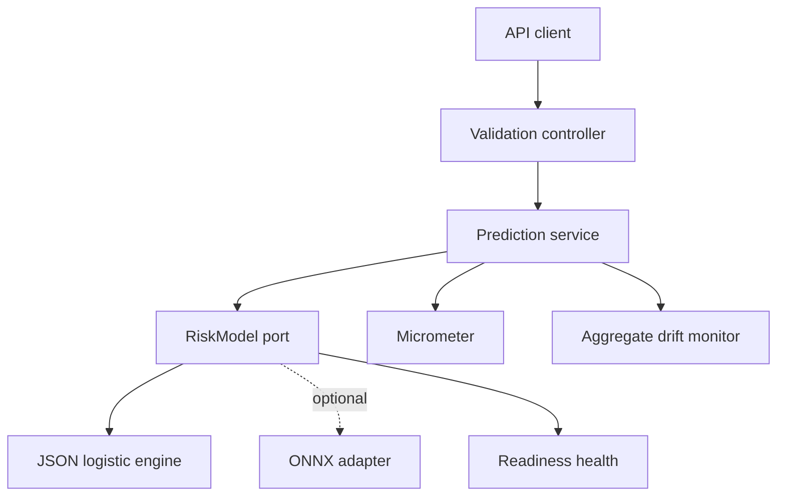

# Architecture

## Goals

RiskLens demonstrates the seam between model development and dependable model serving. The core design goals are deterministic inference, explicit model identity, safe telemetry, replaceable runtimes, and testable feature parity.

## Components

| Component | Responsibility | Retained state |
|---|---|---|
| `PredictionController` | HTTP contract, validation, no-store response | None |
| `PredictionService` | Request lifecycle, metrics, audit-safe event | None |
| `RiskModel` | Stable inference and metadata contract | Model only |
| `LogisticRiskModel` | Parse, validate, hash, and score JSON artifact | Immutable artifact |
| `OnnxScoringPort` | Boundary around native runtime | Provider-defined |
| `DriftMonitor` | Standardized mean-shift signal | Counts and sums only |
| `ModelHealthIndicator` | Readiness based on loaded model | None |

## Inference sequence

1. Spring/Jackson deserializes JSON into `ApplicantFeatures`.
2. Jakarta Validation rejects missing, non-finite, or out-of-range values.
3. The engine performs deterministic feature engineering using the same order as the Python reference scorer.
4. The engine standardizes features from artifact means/scales and calculates a logit.
5. Stored calibration slope/intercept transforms the logit into a probability.
6. Positive feature contributions are ranked into at most three stable reason codes.
7. The service classifies the calibrated probability into a documented band.
8. Micrometer records latency and band count. The drift monitor updates aggregate sums.
9. The response includes the artifact SHA-256 and generated request ID.

## Model artifact lifecycle

The artifact is immutable for the life of a process. Startup loads it from a Spring `Resource`, validates structural invariants, and calculates SHA-256 from exact bytes. A malformed artifact prevents readiness rather than silently falling back.

Promote a model by reviewable artifact replacement, parity test updates, evaluation evidence, container build, and canary deployment. Never overwrite an artifact under an existing version.

## Scaling

The inference engine is immutable and thread-safe. Horizontal replicas can serve independently. Micrometer counters and histograms aggregate in Prometheus. The sample drift monitor is process-local; production deployments should emit allowlisted aggregates to a durable metrics system and calculate fleet-level windows there.

## Decisions

- JSON logistic inference is the default because it is transparent, deterministic, and free of native runtime risk.
- ONNX is an adapter boundary rather than a default dependency so native lifecycle and supply-chain policy remain deployment choices.
- No request persistence is included. A caller requiring audit retention should store a policy-approved decision record outside this service.
- Protected UCI demographic fields are excluded from the input and model. This reduces direct exposure but does not prove fairness.
