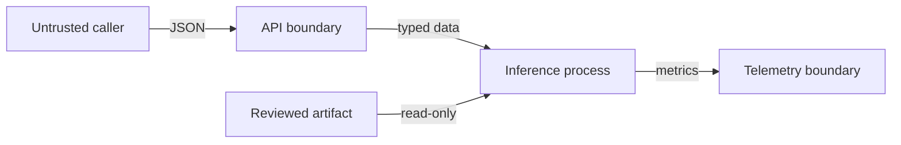

# Threat model

## Scope and assets

The scope is the inference API, model artifact, container, telemetry, and training/export path. Key assets are request confidentiality, model integrity, service availability, audit truthfulness, and dependency integrity.

## Trust boundaries

| Threat | Existing control | Deployment requirement | Residual risk |
|---|---|---|---|
| Oversized or malformed input | Typed schema, numeric bounds, structured 400s | Proxy body limit | Parser and CPU abuse |
| Sensitive-data leakage in logs | Fixed audit-safe fields; no request serialization | Log access policy and retention | Framework/proxy logs need review |
| Model artifact substitution | Exact SHA-256 exposed and immutable after startup | Sign manifest; pin expected digest | SHA alone does not prove origin |
| Model extraction by probing | Probability and reason limits | Authentication, quotas, anomaly detection | Adaptive queries can approximate behavior |
| Denial of service | Stateless engine, validation, non-root image | Rate limit, timeout, autoscaling, circuit breaker | Resource exhaustion |
| Dependency compromise | Maven lock coordinates, CI dependency review | SBOM, signatures, image scanning, update SLA | Transitive supply chain |
| ONNX native-runtime flaw | Not present in default build; isolated port | Pin runtime, scan native binaries, sandbox | Native memory-safety risk |
| Drift endpoint information leak | Only aggregate normalized shifts | Protect as internal endpoint, minimum cohort | Small-cohort inference if misconfigured |
| Unfair or unlawful decision | Synthetic-only disclaimer, protected fields excluded | Governance, subgroup evaluation, human review | Proxy discrimination remains possible |
| Training-data poisoning | Default deterministic generator | Provenance, immutable dataset versions, review | Compromised upstream data |

## Abuse cases

- A caller submits `NaN`, infinity, or extreme ratios. JSON parsing and explicit bounds reject non-conforming values; feature denominators use safe lower bounds.
- An attacker tries log injection. The application never logs caller-controlled strings, and the JSON-like log pattern removes line breaks.
- A malicious model sets zero scale or invalid coefficients. Startup validation rejects it.
- A caller repeatedly probes probabilities. This sample has no identity boundary, so a production gateway must authenticate, authorize, rate limit, and monitor query patterns.

## Security acceptance criteria

- No request feature or response probability appears in application logs.
- Every deployed artifact has a reviewed version, digest, model card, and parity evidence.
- Public ingress cannot reach actuator, drift, or metadata endpoints.
- Containers run as non-root with read-only filesystem and explicit resource limits.
- Critical dependency or base-image findings block promotion.
- Incident response can identify model version from a response or metric without recovering applicant data.
